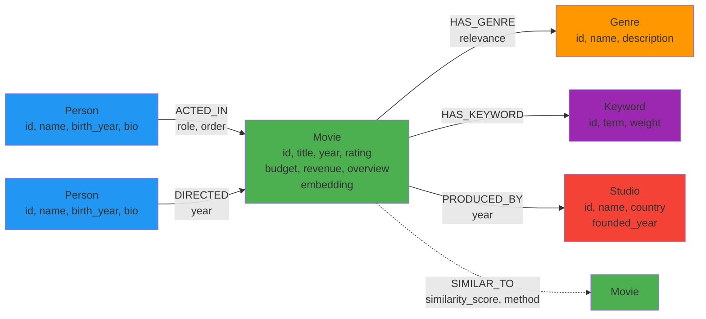

# Knowledge Graph Schema

## Overview
This document defines the enhanced graph schema for the movie recommendation system using Neo4j with vector search capabilities.

## Node Types

### Movie
**Properties:**
- `id` (String, unique): Movie identifier
- `title` (String): Movie title
- `year` (Integer): Release year
- `rating` (Float): IMDb rating (0-10)
- `budget` (Integer): Production budget in USD
- `revenue` (Integer): Box office revenue in USD
- `overview` (Text): Movie description
- `embedding` (Vector[384]): Semantic embedding for similarity search

**Indexes:**
- Unique constraint on `id`
- Vector index on `embedding`

### Person
**Properties:**
- `id` (String, unique): Person identifier
- `name` (String): Full name
- `birth_year` (Integer): Year of birth
- `bio` (Text): Biography

**Indexes:**
- Unique constraint on `id`
- Index on `name`

### Genre
**Properties:**
- `id` (String, unique): Genre identifier
- `name` (String): Genre name (e.g., "Action", "Drama")
- `description` (Text): Genre description

**Indexes:**
- Unique constraint on `id`

### Keyword
**Properties:**
- `id` (String, unique): Keyword identifier
- `term` (String): Keyword/theme term
- `weight` (Float): Importance weight (0-1)

**Indexes:**
- Unique constraint on `id`

### Studio
**Properties:**
- `id` (String, unique): Studio identifier
- `name` (String): Studio name
- `country` (String): Country of origin
- `founded_year` (Integer): Year founded

**Indexes:**
- Unique constraint on `id`

## Relationships

### ACTED_IN
**Direction:** Person → Movie  
**Properties:**
- `role` (String): Character name
- `order` (Integer): Billing order (1 = lead actor)

### DIRECTED
**Direction:** Person → Movie  
**Properties:**
- `year` (Integer): Year directed

### HAS_GENRE
**Direction:** Movie → Genre  
**Properties:**
- `relevance` (Float): Genre relevance score (0-1)

### HAS_KEYWORD
**Direction:** Movie → Keyword  
**Properties:** None

### PRODUCED_BY
**Direction:** Movie → Studio  
**Properties:**
- `year` (Integer): Production year

### SIMILAR_TO
**Direction:** Movie → Movie  
**Properties:**
- `similarity_score` (Float): Cosine similarity (0-1)
- `method` (String): "embedding", "genre", or "keyword"

## Graph Schema Diagram



## Example Cypher Queries

### Create Nodes
```cypher
// Create Movie
CREATE (m:Movie {
  id: 'm1',
  title: 'The Matrix',
  year: 1999,
  rating: 8.7,
  budget: 63000000,
  revenue: 463517383,
  overview: 'A computer hacker learns about the true nature of reality...'
})

// Create Person
CREATE (p:Person {
  id: 'p1',
  name: 'Keanu Reeves',
  birth_year: 1964,
  bio: 'Canadian actor known for action roles'
})

// Create Studio
CREATE (s:Studio {
  id: 's1',
  name: 'Warner Bros',
  country: 'USA',
  founded_year: 1923
})
```

### Create Relationships
```cypher
// Actor relationship
MATCH (p:Person {name: 'Keanu Reeves'}), (m:Movie {title: 'The Matrix'})
CREATE (p)-[:ACTED_IN {role: 'Neo', order: 1}]->(m)

// Director relationship
MATCH (p:Person {name: 'The Wachowskis'}), (m:Movie {title: 'The Matrix'})
CREATE (p)-[:DIRECTED {year: 1999}]->(m)

// Studio relationship
MATCH (m:Movie {title: 'The Matrix'}), (s:Studio {name: 'Warner Bros'})
CREATE (m)-[:PRODUCED_BY {year: 1999}]->(s)
```

### Find Similar Movies
```cypher
// By genre and keywords
MATCH (m1:Movie {title: 'The Matrix'})-[:HAS_GENRE]->(g:Genre)<-[:HAS_GENRE]-(m2:Movie)
MATCH (m1)-[:HAS_KEYWORD]->(k:Keyword)<-[:HAS_KEYWORD]-(m2)
WHERE m1 <> m2
RETURN m2.title, 
       COUNT(DISTINCT g) AS shared_genres,
       COUNT(DISTINCT k) AS shared_keywords,
       (COUNT(DISTINCT g) + COUNT(DISTINCT k)) AS total_similarity
ORDER BY total_similarity DESC
LIMIT 5
```

### Find Movies by Director
```cypher
MATCH (d:Person)-[:DIRECTED]->(m:Movie)
WHERE d.name = 'Christopher Nolan'
RETURN m.title, m.year, m.rating
ORDER BY m.rating DESC
```

### Find Lead Actors
```cypher
MATCH (p:Person)-[r:ACTED_IN]->(m:Movie {title: 'Inception'})
WHERE r.order <= 3
RETURN p.name, r.role, r.order
ORDER BY r.order
```

## Vector Search

### Create Vector Index
```cypher
CREATE VECTOR INDEX movie_embeddings IF NOT EXISTS
FOR (m:Movie)
ON m.embedding
OPTIONS {indexConfig: {
  `vector.dimensions`: 384,
  `vector.similarity_function`: 'cosine'
}}
```

### Semantic Search
```cypher
// Find movies similar to a query embedding
CALL db.index.vector.queryNodes('movie_embeddings', 5, $query_embedding)
YIELD node, score
RETURN node.title, node.overview, score
ORDER BY score DESC
```

### Create SIMILAR_TO Relationships
```cypher
// Create similarity relationships based on embeddings
MATCH (m1:Movie), (m2:Movie)
WHERE m1.id < m2.id AND m1.embedding IS NOT NULL AND m2.embedding IS NOT NULL
WITH m1, m2, gds.similarity.cosine(m1.embedding, m2.embedding) AS similarity
WHERE similarity > 0.8
CREATE (m1)-[:SIMILAR_TO {similarity_score: similarity, method: 'embedding'}]->(m2)
CREATE (m2)-[:SIMILAR_TO {similarity_score: similarity, method: 'embedding'}]->(m1)
```

## Constraints and Indexes

```cypher
// Unique constraints
CREATE CONSTRAINT movie_id IF NOT EXISTS FOR (m:Movie) REQUIRE m.id IS UNIQUE;
CREATE CONSTRAINT person_id IF NOT EXISTS FOR (p:Person) REQUIRE p.id IS UNIQUE;
CREATE CONSTRAINT genre_id IF NOT EXISTS FOR (g:Genre) REQUIRE g.id IS UNIQUE;
CREATE CONSTRAINT keyword_id IF NOT EXISTS FOR (k:Keyword) REQUIRE k.id IS UNIQUE;
CREATE CONSTRAINT studio_id IF NOT EXISTS FOR (s:Studio) REQUIRE s.id IS UNIQUE;

// Performance indexes
CREATE INDEX person_name IF NOT EXISTS FOR (p:Person) ON (p.name);
CREATE INDEX movie_title IF NOT EXISTS FOR (m:Movie) ON (m.title);
CREATE INDEX movie_year IF NOT EXISTS FOR (m:Movie) ON (m.year);
```
